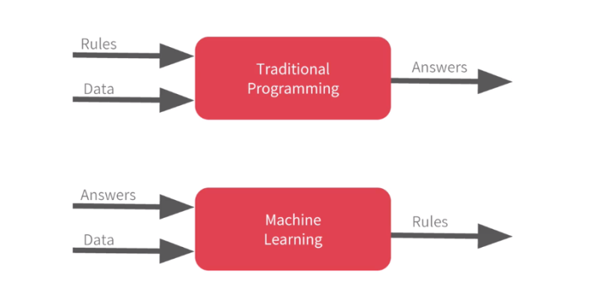
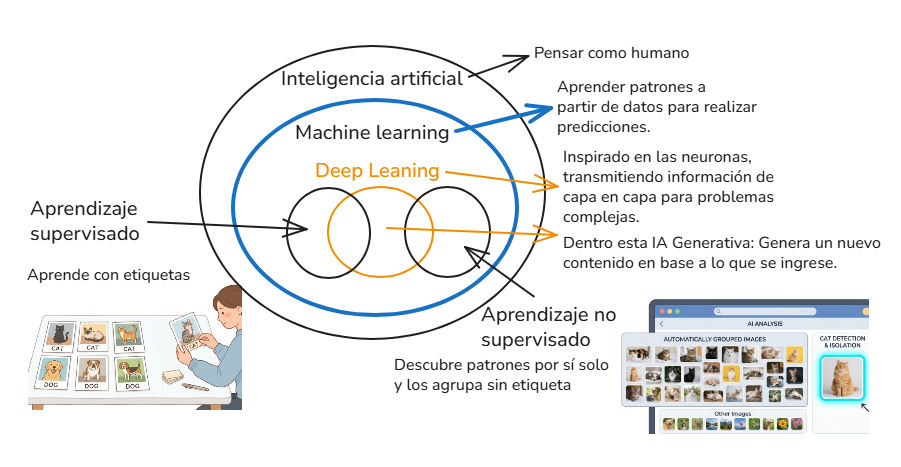
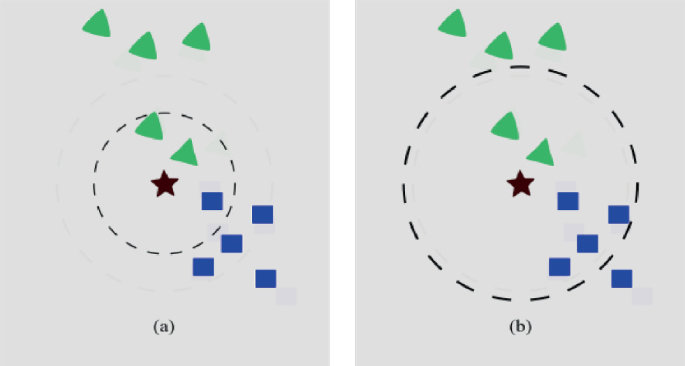
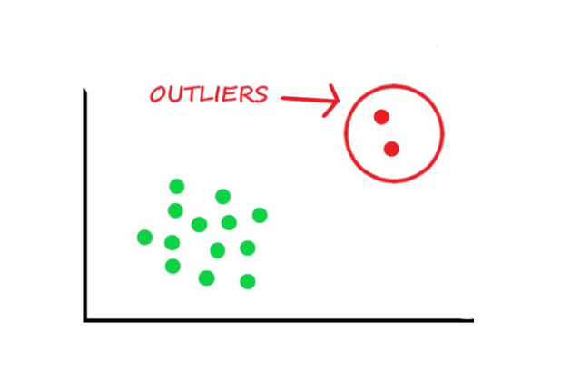

# ¿Qué es machine learning?

Es una rama de la IA, se enfoca de aprender patrones mediante modelo matemático a partir de datos y no necesitan ser programadas explicitamente (Es decir que no necesita que un programador escriba las instruciones), mientras más datos mejor se vuelve prediciendo.

## Conceptos que se menciona en el curso

- Los experiencia de datos se le conoce como *conjunto de entrenamiento*.
- Aprender de datos y realizar predicciones se le llama *modelo*.

## Ejemplo el lo realiza con SPAM
- Proceso tradicional, el programador escribe un algoritmo con gran cantidad de reglas para saber si es spam o no.
- Machine learning, Se obtiene los datos y respuestas que bienen siendo las etiquetas si ese correo es spam o no, el modelo entrega de entregarme las reglas de negocio ya aprendidas.



## Ejercicio con Netflix

Ejemplo: Un sistema de Netflix que recomienda películas según lo que has visto anteriormente

- 📚 Experiencia E: Películas que ya he visto en Netflix.
- 🎯 Tarea T: Predecir otras peliculas nuevas que me pueden gustar.
- 📊 Rendimiento P (Se le conoce como Precisión): Si el modelo acerto su recomendación o no.

## Las ramas de la IA



## Cuándo usar machine learning

1. *Reglas dificiles de definir* como detección de spam, reconocimiento de imagenes, análisis de sentimiento, sistema de recomendación.
2. Necesitas aprender nuevos pratenes no tan evidentes para un humano como detección de fraude financiero, predicción de churn, diagnóstico médico asistido, análisis de comportamiento.
3. Las reglas cambian con el tiempo.
4. Cuando tienes muchos datos historicos pero igual se puede seguir alimientado el modelo si cuentas con pocos datos.
5. Cuando necesitas utilizar probabilidades en vez de intuición, aprender bien en base a nuevos datos.
6. Cuando el coste del error es tolerable ya que machine learning se equivoca no es perfecto.

## Cuándo no utilizar machine learning

- Si puedo resolverlo con reglas simples.
- Con consultas en sql es suficiente.
- Si es solo una validación del negocio.
- No utilizar machine learning para problemas simples.

## Tipos de sistemas de machine learning

### Aprendizaje según tipo de supervisión

- Aprendizaje supervizado: El modelo se entrena con *datos etiquetados*. Cada entrada tiene una salida conocida. Además es costoso necesitas un profesional que vaya a etiquetar como el proceso de radiografias.
- Aprendizaje no supervizado: El modelo trabaja con datos sin etiqueta, solamente busca patrones para agruparlos.
- Aprendizaje semisupervizado: Es una combinación de ambos, combina una pequeña cantidad de datos etiquetados con un gran cantidad de datos sin etiquetar. Es usado cuando etiquetar es costoso.
- Aprendizaje por refuerzo: aprende en base al entorno y el mismo toma decisiones que puede recibir recompesas o castigo. Por ejemplo, el caso del robot que esta aprendiendo a caminar, si se cae castigo y ante diferentes situaciones no se cae premio.

  - Por ejemplo: Como entrenar a un perro
  - ✅ Hace algo bien → Premio
  - ❌ Hace algo mal → Castigo
  - Con el tiempo aprende solo qué decisiones toma

### Aprendizaje según como apreden con el tiempo

- Aprendizaje por lotes: Se entrena usando todo el dataset, una vez entrenado ya no aprende nuevos datos a menos que se reentrene. Se utiliza datos historicos.
- Aprendizaje en línea: El modelo se actualiza de forma continua a medida que lleguen nuevos datos como en streaming.

### Aprendizaje según la forma de generalización
Es la capacidad de un modelo para funcionar bien con datos nuevos y no vistos, no solo con los datos con los que fue entrenado.

- Basado en instancias: Un modelo basado en ejemplos va a memorizar todo los ejemplo que le hayas pasado, va a comprar datos nuevos para clasificar con datos exitentes,*no va a aprender de patrones si no guarda datos de entrenamiento y lo usa con las nuevas instancias, se basa en los vecinos más cercanos*. Esto es costoso a nivel de memoria si hay mucha información ya que los datos de entrenamiento tienen que estar cargado en memoria.



- Basado en modelos: El sistema aprende de un modelo general a partir de los datos y luego lo usa para realizar predicciones. Como regresiones, arboles de decisiones, redes neuronales.
  - Como funciona:
  1. Analiza todos los datos de entrenamiento.
  2. Crea una representación matemática.
  3. El trabajo pesado ocurre en entrenamiento puede ser costoso.
  4. No necesita datos originales para predecir.


## ⚠️ Datos no representativos

El modelo solo puede aprender lo que le muestras. Si los datos no reflejan la realidad donde vas a usar el modelo, aprenderá cosas equivocadas con mucha confianza. Para solucionar esto se debe recolectar datos del contexto correcto.

Ejemplo: Entrenas a un médico peruano mostrando radiografías de pacientes europeos. Aprende patrones pero de otra población. Cuando analice la radiografía de un peruano va a fallar porque los datos de entrenamiento vienen de otro mundo. 

> 💡 **Concepto de generalidad:** el modelo aprende de patrones reales del problema de esos datos y es capaz de hacer buenas predicciones ante datos nuevos.

## ⚠️ Ruido de Muestreo o Sampling Noise

El conjunto de datos es representativo pero con baja cantidad de datos. Lo que va a pasar es que el modelo va a encontrar patrones no tan relevantes que no van a reflejar mi realidad y que pueden afectar la generalización. Para solucionar esto se le debe pasar más cantidad de datos de calidad y mi modelo encontrara mejores patrones. 

## ⚠️ Sesgo de muestreo o Sampling Bias

El problema no es la cantidad de datos, sino cómo se recolectaron. Aunque tengas millones de registros, si todos vienen del mismo grupo sesgado, tu modelo aprenderá los patrones de ese grupo y fallará con los demás. Para solucionar esto se debe recolectar de forma más aleatorio y diversa.

Por ejemplo:
- Imagina que Netflix quiere predecir qué películas le gustan a los peruanos, pero solo recolecta datos de usuarios de Lima que usan la app en Smart TV. El dataset puede ser enorme, pero está sesgado: excluye a personas de otras regiones, a los que usan celular, a adultos mayores, etc. El modelo va a recomendar bien solo para ese subgrupo.
- El caso histórico más famoso: en 1936, la revista Literary Digest hizo una encuesta a 2.4 millones de personas para predecir las elecciones en EE.UU. y falló rotundamente. ¿Por qué? Porque encuestaron por teléfono y correo, lo que sesgó la muestra hacia personas de clase alta. Tenían muchos datos, pero todos del grupo equivocado.

## Valores Atípicos o Outliers

Un outlier es un dato que se aleja tanto del comportamiento esperado que el modelo no sabe bien qué hacer con él. El error está en asumir automáticamente que son "datos malos", cuando en realidad su significado depende completamente del contexto.

Analogía: Imagina que mides la altura de 1,000 personas y la mayoría está entre 1.50m y 1.90m. Si aparece alguien de 2.30m, ese dato es un outlier. Pero ese dato es real, no es un error.

### 🔍 Las causas que puede ocurrir un outliers.
1. 🛠️ Errores de medición
Un sensor defectuoso que registra 0°C en pleno verano, o un formulario donde alguien pone su edad como 999. Estos outliers sí conviene eliminarlos o corregirlos porque son basura, no información real.
2. 🦄 Casos extremadamente poco comunes pero reales
Alguien que gana $500,000 al mes en un dataset de salarios. Es un outlier, pero es un dato verdadero. Eliminarlo haría que el modelo ignore la existencia de ese segmento.
3. ⚡ Eventos muy infrecuentes — y aquí entra tu ejemplo de YAPE
Depositar 20 veces S/0.10 en un minuto es rarísimo en el comportamiento normal de un usuario. Ese patrón es un outlier... y eso es exactamente la señal que el modelo de fraude está buscando.

### 🏦 Tu ejemplo de YAPE, más completo
- Lo que describes es un sistema de detección de anomalías, que es una aplicación directa de outliers en ML:

- El modelo aprende el comportamiento normal de millones de usuarios: montos habituales, frecuencia de transacciones, horarios típicos.
- Cuando tu patrón se aleja drásticamente de esa normalidad (muchos depósitos de S/0.10 en segundos), el modelo lo identifica como un outlier en tiempo real.
- La app bloquea la cuenta no porque sepa con certeza que es fraude, sino porque ese comportamiento tiene una probabilidad muy baja de ser normal.

- Esto se llama detección de anomalías (anomaly detection) y es uno de los casos donde los outliers son literalmente el objetivo del modelo, no un problema a eliminar.

🧠 Resumen para no olvidarlo

- Un outlier no es ni bueno ni malo por definición. Es una señal. Tu trabajo es entender qué te está diciendo.

- En algunos modelos como regresión lineal, un solo outlier puede torcer toda la curva aprendida y arruinar las predicciones. En otros como detección de fraude, ese outlier es exactamente lo que el modelo debe aprender a encontrar. El contexto del problema siempre manda.




## 🔴 Overfitting: "El estudiante memorizón"
 
### ¿Qué es?
El modelo **aprende demasiado bien** los datos de entrenamiento: memoriza incluso el ruido, los errores y los datos irrelevantes. El resultado: **falla estrepitosamente con datos nuevos**.
 
### Explicación simple
> *Es como un estudiante que memoriza exactamente las preguntas del examen pasado. Si le cambias aunque sea una palabra, no sabe qué responder.*

### Causas principales
 
- 📉 **Pocos datos** de entrenamiento
- 📊 **Datos con outliers** (valores extremos atípicos)
- 🔊 **Datasets con ruido** (datos incorrectos o sucios)
- 🤖 **Modelos demasiado complejos** con demasiadas características (variables)

---
 
## 🟡 Underfitting: "El estudiante que no estudió"
 
### ¿Qué es?
El modelo **no aprende suficiente** de los datos de entrenamiento. No encuentra patrones relevantes y, por tanto, tampoco generaliza bien a datos nuevos.
 
### Explicación simple
> *Es como intentar predecir el precio de una casa sabiendo SOLO cuántos cuartos tiene. Con tan poca información, nunca llegarás a una buena predicción.*

### Ejemplo concreto: Predicción del precio de casas 🏠
 
**❌ Underfitting:**
```
Entradas: número de habitaciones + tamaño de la casa
Resultado: el modelo aprende muy poco → predicciones muy imprecisas
```
 
**✅ Modelo adecuado:**
```
Entradas: habitaciones + tamaño + ubicación + año de construcción
         + servicios cercanos + estado del inmueble + ...
Resultado: el modelo captura la realidad → predicciones más precisas
```
 
### Causa principal
- El modelo tiene **poca capacidad de aprendizaje** (muy pocas variables o muy poca complejidad)
---

## 🟢 Regularización: "El maestro que pone límites"
 
### ¿Qué es?
Una técnica que **penaliza la complejidad excesiva** del modelo durante el entrenamiento. Le dice al modelo: *"No te vuelvas demasiado sensible a los datos de entrenamiento. Aprende lo general, no lo específico."*
 
### Explicación simple
> *La regularización es como un profesor que le dice al estudiante: "No memorices, entiende los conceptos. En el examen final te preguntaré cosas que nunca has visto."*

### ¿Cómo funciona?
 
```
Sin regularización:
Modelo → se ajusta PERFECTAMENTE a datos de entrenamiento
       → overfitting → falla en datos nuevos
 
Con regularización:
Modelo → penaliza el ajuste excesivo
       → aprende patrones GENERALES
       → funciona bien en datos nuevos ✅
```
 
### ¿Qué "penaliza" exactamente?
Penaliza los pesos (coeficientes) del modelo cuando se vuelven demasiado grandes o extremos, evitando que se "tuerzan" demasiado hacia los datos de entrenamiento.
 
---
 
## 🗺️ Mapa Mental del Concepto
 
```
                    APRENDIZAJE DEL MODELO
                           │
           ┌───────────────┼───────────────┐
           │               │               │
      UNDERFITTING    EQUILIBRIO      OVERFITTING
      (aprende poco)  (zona ideal ✅)  (aprende de más)
           │               │               │
      Modelo simple    Regularización  Modelo complejo
      Pocas variables  bien ajustada   Memoriza el ruido
           │               │               │
      Falla en           Funciona        Falla en
      todo              bien             datos nuevos
```
 
---
 
## ✅ Resumen Rápido
 
| Concepto | ¿Qué hace el modelo? | ¿Cómo se ve el error? | Solución |
|----------|----------------------|------------------------|----------|
| **Underfitting** | No aprende suficiente | Error alto en entrenamiento Y en prueba | Más datos, más variables, modelo más complejo |
| **Overfitting** | Aprende demasiado (incluso el ruido) | Error bajo en entrenamiento, alto en prueba | Regularización, más datos, reducir complejidad |
| **Regularización** | Penaliza el exceso de ajuste | Equilibra ambos errores | Técnica para prevenir el overfitting |
 
---
 
## 💡 Regla de Oro para Recordarlo
 
> **"Un buen modelo no memoriza, generaliza."**
>
> La regularización es el mecanismo que asegura que tu modelo aprenda **patrones reales del mundo**, no los caprichos de tu conjunto de datos de entrenamiento.
 
---
